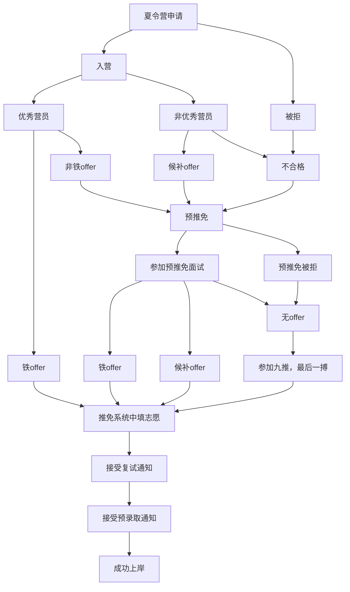

# 经验分享贴 :eyes:

首先来一张图带你看懂保研整个过程！

在这张图中不难发现，其实保研有三次机会，夏令营，预推免和九推,机会还是很多的，不用担心 :fist_raised:

- **夏令营**
  - 时间：每年 5-8 月
  - 地点：一般在线下举行（部分院校线上举行）,有各种活动
  - 难度：**入营门槛高**（看重本科院校、成绩排名、科研情况等）
  - offer 情况：大部分优秀营员等同于直接拟录取，部分院校超发 offer，小部分院校优秀营员后仍需参加复试
- **预推免**
  - 时间：每年 8-9 月
  - 地点：一般线上或线下举行，直接面试和笔试
  - 难度：**入面门槛低**（看重专业、科研、英语水平等）
  - offer 情况：效力较高，部分院校要求签署承诺书
- **九推**
  - 时间：每年 9-10 月
  - 难度：部分未招满的院校可能会降低要求，但名额极少且风险较高，不建议冲刺新学校

## 夏令营

### 材料准备

根据上文的文书材料准备即可，建议都整理成`pdf`的形式。

### 策略选择

有些人会选择海投，即把能投的都投了，把能申请的都能申请一遍，这固然能保证其最大利益，但是这种行为**比较极端**，不太可取，原因如下：

- **浪费时间**：虽然每个学校要求提交的材料都差不多，做好申请一个学校夏令营的材料后，稍微改一改又能投另一个学校，乍看起来不费什么时间，但其实会浪费大量时间。
- **影响排名比你后的人**：有一个说法是，能不能进夏令营主要看本科学校和专业排名，而一个学校给你本科学校的名额肯定是有限的，最可气的是你占用了入营名额却不去参加，当然了有些人可能会说我排名就是比他高，有本事他排名比我高啊，你要这么想我也没办法 :boy:。
- **影响后辈（学弟学妹）**：因为你只能保研到一个学校，所以你进的夏令营越多，就要鸽掉越多，被鸽的学校不爽的时候，可能就会把你的本科学校拉入黑名单。

既然没必要海投，那么问题来了，该申请怎么样的学校？

- **你本来就想去的学校**，可能是你高中的梦想
- **你想去的城市的学校**，如很多人想去北上广深，大城市各种资源都多，就业机会多，未来也想往那里发展
- **不要一股脑全报最好的学校**，就想高考后填志愿一样，可以把你要申请的学校分为冲一冲、稳一稳、保一保。这时候不要那么自信 :joy:
- **也不要一味地报保底学校**，你都保研了可以适当冲一冲，机会是留给有准备的人的

可以**分层次选择**"保底-冲刺-梦校",注意时间冲突时合理取舍。避免因信息差错过机会，有些院校夏令营招满后不再开放预推免！这里推荐几个比较靠谱的夏令营搜索策略：

- [微信小程序-保研通](#小程序://夏令营搜索/PS429wr0LsBDTGm)
- 及时关注各大高校的公众号信息，了解最新的夏令营信息
- 关注各大高校的官网网站，这里会发布夏令营相关信息

?> 很多人都说，研究生方向比学校更重要、城市比学校更重要，但你无法预见未来的任何事，有些时候曲线救国反而能歪打正着，选择自己想要的、不会排斥的、看起来不错的就好 :lollipop:

### 夏令营形式

保研夏令营通常包括以下环节的若干个:

1. 开营仪式
2. 学术报告
3. 学校/院系/实验室介绍
4. **面试（可能会有笔试或者机考）**
5. 参观校园
6. 学术讲座
7. 结营仪式

对于我们来说，最重要的环节就是面试了，一般通过面试就相当于**上岸**了,当然了，也不乏有些院校超发 offer,不过有些院校是属于**弱 com**系列，一般要满足下列条件才算上岸。

- 通过面试拿到优秀或者合格
- 有导师愿意接收你

### 面试

!> 一定要记住这一点，老师问的每个问题都有意义，他必然可以从你的回答中提取从什么重要信息。

#### 自我介绍

不同学校对**中文还是英文**、**时长**有不同的要求，自己提前先捋一捋思路，想想从哪些方面介绍对自己有利，如果是中文自我介绍一定不要背模板，会显得很空洞。

一般可以说以下的内容：

- **开场白（问候/客套）**
- 姓名/学校/专业
- 成绩/奖学金
- **竞赛/项目/论文/科研**
  - 这些都没有的话也可以说一下课程设计或者对科研的兴趣
- **性格/对科研的兴趣**
- **夸一夸目标院校**
  - 比如说 XX 大学一直是我的梦中情校
- 致谢

**很多学校都会要求英文自我介绍**，但是你在自我介绍时，老师只关注一点：

- 英语口语是不是还行，说话流利与否

也就是说其实老师也不关注你介绍了什么，他们利用你自我介绍期间通过**看你的简历了解你**，发掘可以问的问题。所以，在准备英文自我介绍时，尽量避免使用你并不熟悉的词汇，以免给自己添加负担，得不偿失！

#### 专业课问题

老师通过你的**简历 / 成绩单 / 自我介绍**确定要问什么科目的问题。这时候这些科目容易被问到：

- 参加过的竞赛相关的课程，介绍的项目/论文/科研相关的
- 自我介绍时提到的「对 XXX 感兴趣」
- 有些学校会先简单粗暴地问你：“挑一个你比较擅长的科目吧！”

#### 英语问题

这个环节主要考察你的英语能力、口语水平。问题一般很简单，但是**不乏有些院校英文问题来回答专业课问题**，因此最好提前把有可能问道的问题都准备一遍，不要求特别熟悉，但是要记得大概（在面试那种紧张气氛通常难以很好地即兴发挥）。通常会问到类似以下问题：

- Why do you choose this major?
- Introduce Your Hobbies.
- Introduce Your College.

!> 要是遇到英文问专业课相关的问题就临时发挥吧，有的问题我用中文都不懂怎么回答好吧 :cry:

#### 面试的其他问题

有些学校可能会提问一些政治问题或者心理问题，这类题一般比较简单，从容回答即可

## 预推免

8-9 月

## Suggestions

### 如何获取夏令营通知消息

将自己感兴趣的学校列举出来，直接去该院校相关学院或研究生院官网查看。

### 如何了解老师

保研 / 考研时**老师和学生其实是不对等的**，对于老师来说，错过你一个可能并不会影响什么，但是对于学生来说就不是这样。

在选老师的时候，**人品**是远比其他方面（学术水平、科研能力、学生毕业去向）更重要的东西。毕竟近年来爆出了很多导师压榨学生致使学生自杀的事件令人寒心 :grimacing:

?> 分享一个找导师的冷知识，大家可以去知网上检索老师带过的学生的学位论文（学位论文板块按导师检索），然后翻到【致谢】部分。一般来说，如果致谢写得比较感人，写出真情实感的，那么这个老师坑的概率会比较小。如果只有寥寥几行字或者都是套话，那可能要小心了。换位思考一下，如果一个导师坑了你三年/五六年，你还会花多少笔墨来赞美他呢.

### 学校实力

可参看比较权威的排名，公认最权威的世界大学排名有：

- US News：[https://www.usnews.com/education/best-global-universities/china](https://www.usnews.com/education/best-global-universities/china)
  - 美国新闻与世界报道（U.S. News & World Report）世界大学排名
- QS：[https://www.topuniversities.com/world-university-rankings/2024](https://www.topuniversities.com/world-university-rankings/2024)
  - QS (Quacquarelli Symonds) 世界大学排名
- THE：[https://www.timeshighereducation.com/world-university-rankings/2024/world-ranking#!/page/0/length/25/locations/CN/sort_by/rank/sort_order/asc/cols/stats](https://www.timeshighereducation.com/world-university-rankings/2024/world-ranking#!/page/0/length/25/locations/CN/sort_by/rank/sort_order/asc/cols/stats)
  - 泰晤士高等教育（Times Higher Education）世界大学排名
- ARWU：世界大学学术排名（Academic Ranking of World Universities），上海交大推出，俗称上海排名、软科排名。
- 全国高校学科评估: https://www.cdgdc.edu.cn/

!> 不过，排名看看就好了，只要自己觉得学校好就行。

> 「我不要你觉得，我要我觉得。」 只要自己认为自己的选择没错就好。 也没必要嘲讽别人的学校。 每个选择（对学校的选择、对学硕 / 专硕的选择、对职业的选择）都值得受到尊重。

<iframe height="150" width="100%" frameborder="0" src="https://sponsor.zhang0001.com/"></iframe>
