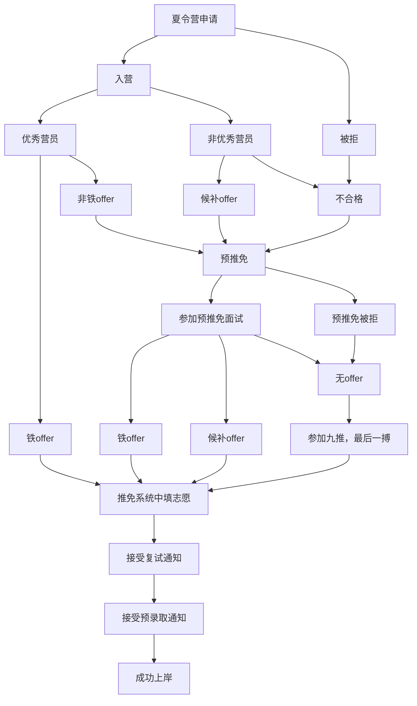

```mermaid
graph TB
    A[夏令营申请]
    A1[入营]
    A2[被拒]
    A11[优秀营员]
    A12[非优秀营员]
    r1[铁offer]
    r2[候补offer]
    r3[非铁offer]
    r4[不合格]
    B[预推免]
    B1[参加预推免面试]
    B2[预推免被拒]

    A-->A1
    A-->A2
    A1-->A11
    A1-->A12
    A11-->r1
    A11-->r3
    A12-->r2
    A12-->r4
    A2-->r4
    r2-->B
    r3-->B
    r4-->B
    B-->B1
    B-->B2
    B1-->C1[铁offer]
    B1-->C2[候补offer]
    B1-->C3[无offer]
    B2-->C3
    r1-->r[推免系统中填志愿]
    C1-->r
    C2-->r
    r-->l[接受复试通知]
    l-->l1[接受预录取通知]
    l1-->l2[成功上岸]
    C3-->D1[参加九推，最后一搏]
    D1-->r
```
